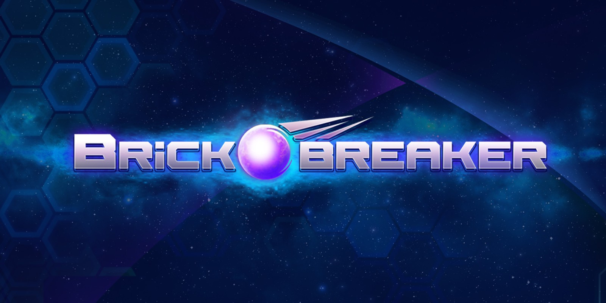
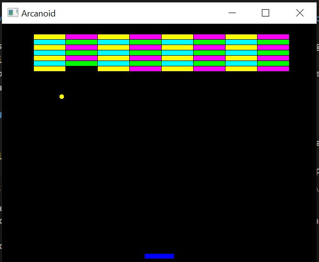

# Bricks-Breaker





<video controls src="brick_video.mp4" title="Gameplay Video"></video>

Este proyecto es una implementación simple del clásico juego arcade "Arkanoid" utilizando la biblioteca SFML en C++. El juego consiste en controlar una paleta para hacer rebotar una bola y romper bloques. El objetivo es despejar todos los bloques sin dejar que la bola caiga fuera de la pantalla.

## Características

- **Mecánicas de la Paleta y la Bola**: Controla una paleta para hacer rebotar una bola, rompiendo bloques al colisionar.
- **Bloques**: Varias filas de bloques de colores para romper.
- **Power-Up (Pastilla)**: Ocasionalmente, aparece un power-up que duplica el tamaño de la paleta cuando se recoge.
- **Efectos de Sonido**: Diferentes sonidos para la colisión bola-pared, bola-paleta y bola-bloque.
- **Condiciones de Victoria y Derrota**: Gana al despejar todos los bloques y pierde si la bola toca el fondo de la ventana.

---

## Programas Necesarios

1. **Visual Studio Code**  
    Descargar e instalar Visual Studio Code desde el siguiente [enlace](https://code.visualstudio.com).

2. **MSYS2 (Windows)**  
    Instalar MSYS2 usando el siguiente [enlace](https://www.msys2.org).  

    Agregar los siguientes directorios al `Path` de Windows y reiniciar:
    ```
    C:\msys64\mingw64\bin
    C:\msys64\usr\bin
    ```

3. **GitHub Desktop**  
    Cliente de escritorio para clonar el repositorio, descargar usando este [enlace](https://desktop.github.com).

4. **Git**  
    Para realizar commits desde Visual Studio Code es necesario tener instalado Git. Descargarlo del siguiente [enlace](https://git-scm.com).

---

## Instalación de Librerías en MSYS2

1. Instalar las herramientas base de desarrollo y la cadena de herramientas para `mingw64`:
    ```bash
    pacman -S --needed base-devel mingw-w64-x86_64-toolchain
    ```

2. Instalar la biblioteca SFML:
    ```bash
    pacman -S mingw-w64-x86_64-sfml
    ```

3. Instalar la biblioteca Box2D:
    ```bash
    pacman -S mingw-w64-x86_64-box2d
    ```

## Complementos para Visual Studio Code

- Material Icon Theme
- C/C++ Extension Pack
- Plant UML
- CMake Tools
- GitGraph

## Instalación

### Clonar el Repositorio

Clona este repositorio en tu máquina local:
```bash
git clone https://github.com/BloemCosmos/Bricks-Breaker.git
```

### Compilar el Proyecto

Navega al directorio del proyecto y compila el código:
```bash
cd arcanoid-game
g++ -o arcanoid main.cpp -lsfml-graphics -lsfml-window -lsfml-system -lsfml-audio
```

## Uso

### Ejecutar el Juego

Compilar:
```bash
make all
```

O en Visual Studio Code:
```bash
bin\Main.exe
```

### Controles de la Paleta

Usa las teclas de flecha izquierda y derecha para mover la paleta.

### Jugabilidad

- Haz rebotar la bola con la paleta para romper los bloques.
- Recoge el power-up para agrandar temporalmente la paleta.
- Despeja todos los bloques para ganar el juego.
- Evita que la bola caiga fuera de la pantalla para no perder el juego.

## Estructura del Juego

### Variables y Estructuras

- **Estructura del Bloque**: Representa cada bloque con un estado y una forma rectangular.
- **Estructura de la Pastilla**: Representa el power-up con un estado y una forma rectangular.
- **Bola**: Una forma circular que representa la bola.
- **Paleta**: Una forma rectangular que representa la paleta.
- **Variables de Estado**: Varias variables para rastrear el estado del juego, incluidos bloques activos, velocidad de la bola, detección de colisiones y estado del juego.

### Inicialización

- **Ventana**: Crea una ventana de juego con dimensiones específicas y un límite de fotogramas.
- **Formas**: Inicializa las formas de la bola, la paleta, los bloques y la pastilla con posiciones y colores.
- **Fuentes y Sonidos**: Carga las fuentes y archivos de sonido necesarios.

### Bucle del Juego

- **Manejo de Eventos**: Captura y maneja los eventos de la ventana.
- **Lógica del Juego**: Actualiza el estado del juego, incluyendo el movimiento de la bola, la detección de colisiones y el control de la paleta.
- **Renderizado**: Limpia la ventana, dibuja los elementos del juego y muestra el fotograma actualizado.

## Activos

- **Fuentes**: Asegúrate de que `Fonts/Arial.TTF` esté en el directorio correcto.
- **Sonidos**: Asegúrate de que los archivos de sonido `ReboteParedes.wav`, `RebotePaleta.wav` y `ReboteLadrillo.wav` estén en el directorio correcto.

## Creado por

- Luis Daniel Brambila Ramos (Reg: 23110116)
- Alan Giovanni Garcia Galvan (Reg: 23110140)

## Agradecimientos

Este proyecto fue inspirado por el clásico juego Arkanoid. Un agradecimiento especial a la comunidad de SFML por proporcionar una robusta biblioteca multimedia.

## Licencia

Este proyecto está licenciado bajo la Licencia MIT. Consulta el archivo LICENSE para más detalles.

¡Siéntete libre de modificar y ampliar este proyecto para agregar más características y mejorar la experiencia de juego! ¡Feliz programación!
